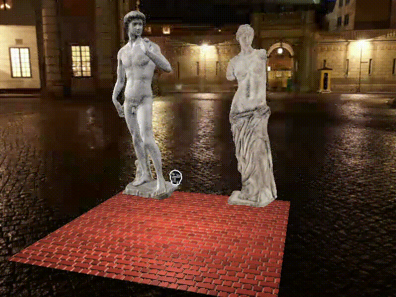

# ComputerGraphics

Все библиотеки и заголовочные файлы, находятся в репозитории, поэтому чтобы собрать проект достаточно нажать на соответствующую кнопку в Visual Studio.
Программа моделирует следующую ситуацию:
Голова императора Константина преисполняется искусством и возносится "на тот свет".
Чтобы смоделировать эту ситуацию программа использует следующие эффекты:
1. Постэффект - применение к голове Константина фильтра Собеля для выделения границ. Это создает эффект, того что душа покинула голову.
2. (?) Нетривиальный морфинг и анимация с изменением связности объекта - при вознесении на тот свет голова Константина разрывается на много маленьких точек. Работа с геометрическим шейдером.
3. Кубические текстуры 
4. Попиксельный расчет освещенности по стандартным методам. - для кирпича модель Блинна-Фонга.
5. Normal mapping - в параллакс шейдере
6. Relief Parallax mapping - используется для рендера кирпича

21.12.20 была внесена правка - я поменял Parallax Mapping на Relief Parallax Mapping в рендере кирпича.
